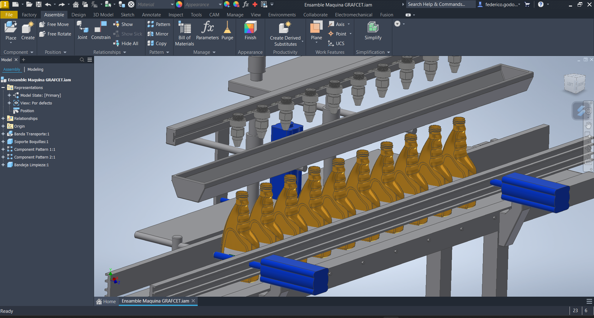

# Proyect Introduction 
GRAFCET project created for the pneumatic power course, where we had to select a machine, obtain its sequence, and then use this information to design the machine in Autodesk Inventor CAD software. In addition, the Automotion Studio software was used to present a complete simulation of the machine's operation, the Petri net, the simulation of the connections to the PLC, along with all the LADDER programming of the system.  
[This is the direct link to the video, which provides a description of everything included in the project and an explanation.](https://youtu.be/RDDje7MGE70)

# Selected Machine and its Operating Sequence
## Machine
This machine is responsible for filling 10 bottles of viscous fluid per section. The four pneumatic pistons used in the machine are marked in yellow and labeled with the letters (A, B, C, D). The bottles to be filled are also shown.

## Machine Operating Sequence
The sequence of this machine is summarized as follows: [A-B+A+C-D+D-C+B-].  
The machine operates in the following order: Pistons A and C start extended, while pistons B and D start closed. Then, piston A is the first to move, closing to allow the bottles to begin positioning themselves. After this piston is closed, sensor A0 gives the signal for piston B to extend and begin accumulating the bottles to be filled. When sensor B1 indicates that it is fully extended, piston A extends again, which is responsible for ensuring that no more than the specified number of bottles (10) pass through, ensuring that the bottles are ready to be filled. When sensor a1 indicates this, piston C, which is responsible for the cleaning tray, closes to make space available for the filling nozzles. When sensor c0 indicates that it is completely closed, piston D, which is responsible for the filling nozzles, extends so that the bottles can be filled with viscous fluid. When sensor d1 indicates that it is fully extended, a 5-second countdown is performed to show that the bottles are being filled. After this time, piston D closes, indicating that the bottles have been filled, and sensor d0 gives the indication for this. The filled bottles continue their journey, and the machine prepares to start another process. 

# Machine Design in Autodesk Inventor (CAD)
The machine was created from scratch in Inventor, using the image where the sequence was built as a model. In the machine, the pneumatic pistons are blue, and the bottles to be filled are represented by orange vehicle oil bottles. The images show the motor, the cleaning tray, and the filling nozzles next to the connections to the pistons so that the movement of the machine is fully represented.

# Machine Simulation in Automotion Studio
The simulation created in Automotion indicates all the elements that are included and necessary for the machine to operate. We will now proceed to describe everything that belongs to the system.

In the image, we see the four pistons labeled (A, B, C, D), each of which is connected to a 5/2 monostable solenoid valve. In addition, there are two magnetic sensors on the piston skirt, labeled according to the piston on which they are located. These sensors indicate (1,0) depending on whether the piston is extended or closed. 

### Individual Pneumatic System
Piston C is shown as an example, which is responsible for the cleaning tray. 

### Buttons
 In this same image, on the right-hand side, we find a series of buttons, each of which counts as an input for the PLC, for the Petri net, and likewise for the LADDER. 
We therefore have four buttons: two green ones, one blue one, and the emergency stop button, which is red.

The first green button is responsible for starting the entire system, which we refer to in the TIA Portal as OB100. 
The second green button is responsible for activating a relay, whose normally closed pins contain the three phases necessary to activate the motor. This is responsible for starting the movement of the conveyor belt. The location of the motor can be seen in the Inventor model section. 
The blue button activates the entire pneumatic line of the machine, allowing air to pass through all the solenoid valves. 
Finally, we have the emergency stop button, which is responsible for cutting off the power and stopping the entire process. The LADDER will then show where the reset for this button goes, in order to determine the position in which the entire system is initialized.

### Motor Conections
The motor connection diagram shows how the three motor phase lines are connected by activating a relay. The relay is connected to the PLC at output 0. This motor drives the conveyor belt and never stops unless the emergency stop button is pressed, which is activated by the starter button at input 13 of the PLC. 

### Led Fill Indicator
The LED bulb is responsible for providing a visual indication of when the bottles are being filled with viscous liquid. It lights up green throughout the entire filling process. The LED connection is located at output 13 of the PLC.

# Input and Output Connections (PLC Connections)
With the system and operation of the machine described. We will now proceed to illustrate the inputs and outputs of the system, making it easier for the reader to understand and manage.  
So, now we are going to look at a virtual PLC from the Automotion Studio program, where the inputs are integrated on the left side and the outputs on the right side, each of which has its description in black. 
The system, like PLCs, has 24 V inputs and outputs, which explains why the connections are direct to sensors, solenoids, buttons, and coils. 

